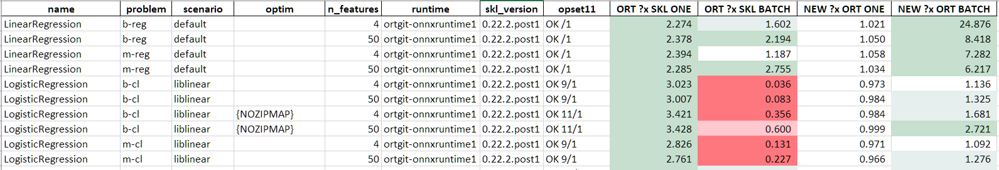

.. _l-onnx-tutorial-benchmark-orts:

Compare two different onnxruntime
=================================

The following section uses what is introduced at
:ref:`l-benchmark-onnxruntime-skl-regular` to
compare two different version of :epkg:`onnxruntime` on
a given list of models.

Bash script
+++++++++++

The following script compares *onnxruntime 1.1.2* to a local
version of *onnxruntime* installed through a local *pypi server*
available at `http://localhost:8067/`.

::

    export models="LinearRegression,LogisticRegression,RandomForestRegressor,RandomForestClassifier,SVR,SVC"
    export NOW=$(date +"%Y%m%d")
    export suffix="LRSW-"$NOW

    echo --ORT112-ENV--
    export vers="112"
    python -m virtualenv ort112 || exit 1
    cd ort112
    ./bin/python -m pip install -U pip
    ./bin/pip install numpy scikit-learn onnx pyquickhelper matplotlib threadpoolctl lightgbm xgboost || exit 1
    ./bin/pip uninstall -y onnxruntime
    ./bin/pip install onnxruntime==1.1.2 || exit 1
    ./bin/pip install --no-cache-dir --no-deps --index http://localhost:8067/simple/ onnx onnxconverter-common skl2onnx || exit 1
    ./bin/pip install --no-cache-dir --no-deps --index http://localhost:8067/simple/ mlprodict || exit 1
    ./bin/pip freeze || exit 1
    echo --ORT112-BENCH--
    ./bin/python -m mlprodict validate_runtime --n_features 4,50 -nu 3 -re 3 -o 11 -op 11 -v 1 --out_raw data$vers$suffix.csv --out_summary summary$vers$suffix.csv -b 1 --dump_folder dump_errors --runtime python_compiled,onnxruntime1 --models $models --out_graph bench_png$vers$suffix --dtype 32 || exit 1
    echo --ORT112-END--
    cd ..

    echo --NEW-ENV--
    export vers="GIT"
    python -m virtualenv ortgit || exit 1
    cd ortgit
    ./bin/python -m pip install -U pip
    ./bin/pip install numpy scikit-learn onnx pyquickhelper matplotlib threadpoolctl lightgbm xgboost || exit 1
    ./bin/pip uninstall -y onnxruntime
    ./bin/pip uninstall -y onnxruntime-dnnl
    ./bin/pip install --no-cache-dir --no-deps --index http://localhost:8067/simple/ onnxruntime || exit 1
    ./bin/pip install --no-cache-dir --no-deps --index http://localhost:8067/simple/ onnx onnxconverter-common skl2onnx || exit 1
    ./bin/pip install --no-cache-dir --no-deps --index http://localhost:8067/simple/ mlprodict || exit 1
    ./bin/pip freeze || exit 1
    echo --NEW-BENCH--
    ./bin/python -m mlprodict validate_runtime --n_features 4,50 -nu 3 -re 3 -o 11 -op 11 -v 1 --out_raw data$vers$suffix.csv --out_summary summary$vers$suffix.csv -b 1 --dump_folder dump_errors --runtime python_compiled,onnxruntime1 --models $models --out_graph bench_png$vers$suffix --dtype 32 || exit 1
    echo --NEW-END--
    cd ..

    echo --END--

Merge results
+++++++++++++

It produces two files: ``data112LRSW-20200311.csv`` and ``dataGITLRSW-20200311.csv``.
The following script merges them and computes a speed-up between the two versions
and with :epkg:`scikit-learn`.

::

    from pprint import pprint
    import pandas
    from mlprodict.onnxrt.validate.validate_summary import merge_benchmark, summary_report

    names = {'ort112-': 'data112LRSW-20200311.csv',
             'ortgit-': 'dataGITLRSW-20200311.csv'}
    dfs = {k: pandas.read_csv(v) for k, v in names.items()}

    merged = merge_benchmark(dfs, baseline="ort112-onnxruntime1")
    print('runtimes')
    pprint(set(merged['runtime']))

    add_cols = list(sorted(c for c in merged.columns if c.endswith('-base'))) + ['ort_version']
    pprint(add_cols)
    suma = summary_report(merged, add_cols=add_cols, add_index=['ort_version'])

    pprint(suma.columns)

    keep = [
        'name', 'problem', 'scenario', 'optim', 'n_features', 'runtime',
        'skl_version', 'opset11',
        'RT/SKL-N=1',
        'RT/SKL-N=1-base',
        ]
    suma = suma[keep].copy()

    def replace(x):
        if not isinstance(x, str):
            return x
        return x.replace(
            "'zipmap': False", "NOZIPMAP").replace(
            "'raw_scores': True", "RAW")

    suma['ORT ?x SKL ONE'] = 1. / suma["RT/SKL-N=1"]
    suma['ORT ?x SKL BATCH'] = 1. / suma["N=10000"]
    suma['NEW ?x ORT ONE'] = 1. / suma["RT/SKL-N=1-base"]
    suma['NEW ?x ORT BATCH'] = 1. / suma["N=10000-base"]
    suma['optim'] = suma['optim'].apply(replace)
    suma = suma.drop(['RT/SKL-N=1', 'N=10000', 'RT/SKL-N=1-base', 'N=10000-base'], axis=1)

    writer = pandas.ExcelWriter('merged.xlsx', engine='xlsxwriter')
    suma.to_excel(writer, index=False, float_format="%1.3f",
                  freeze_panes=(1, 1))
    workbook  = writer.book
    format0 = workbook.add_format({'bg_color': '#FF777E'})
    format1 = workbook.add_format({'bg_color': '#FFC7CE'})
    format2 = workbook.add_format({'bg_color': '#E6EFEE'})
    format3 = workbook.add_format({'bg_color': '#C6DFCE'})
    worksheet = writer.sheets['Sheet1']
    pl = 'I2:L{}'.format(merged.shape[0] + 1)
    worksheet.conditional_format(
        pl, {'type': 'cell', 'criteria': '<', 'value': 0.5, 'format': format0})
    worksheet.conditional_format(
        pl, {'type': 'cell', 'criteria': '<', 'value': 0.8, 'format': format1})
    worksheet.conditional_format(
        pl, {'type': 'cell', 'criteria': '>=', 'value': 2., 'format': format3})
    worksheet.conditional_format(
        pl, {'type': 'cell', 'criteria': '>=', 'value': 1.2, 'format': format2})
    writer.save()

The outcome is a spreadsheet which looks like this:

Notes
+++++

The script could be improve to measure some confidence interval.
That's left for later. The speedup computation is not
entirely accurate as it compares two different runtime
to *scikit-learn* but not exactly the same one. Every benchmark
works independently, it runs *scikit-learn*. It assumes the every run
of every same model returns similar results.
For a better metric, the ONNX models should
be generated first and only then the runtimes should be compared
but it gives at least an order of magnitude.
